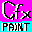
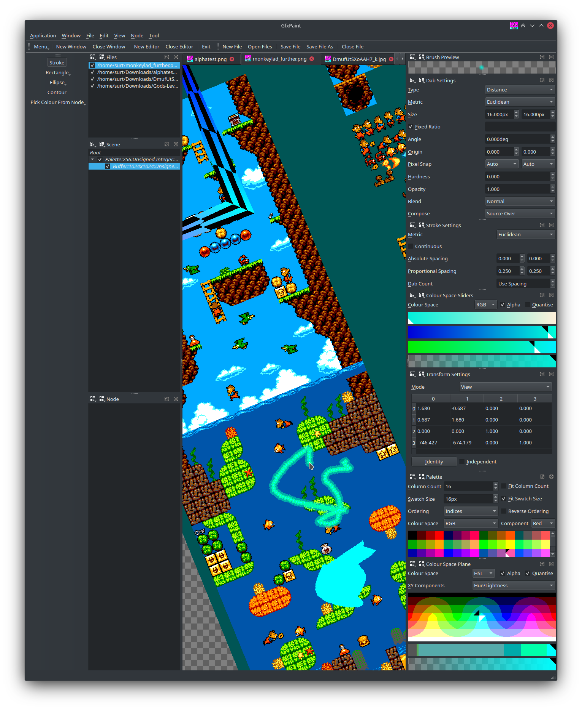

GfxPaint 
========

Description
-----------
Qt + OpenGL + scenegraph based indexed image editor with a focus on indexed-colour pixelart.

>   **WARNING: nowhere near usable state!**
>
>   Badly broken, sporadically abandoned, unusable.

Contents
--------
1.  [Usage](#usage)
2.  [Building](#building)
3.  [Philosophy](#philosophy)
4.  [License](#license)

Usage
-----
Operating requirements:
-  Desktop OpenGL 4.3 or OpenGL ES 3.2

Building
--------
Build requirements:
-   Qt 6.2 (maybe other versions)
-   C++20
-   GCC/CLANG (maybe other compilers)

Build with Qt Creator/qmake for Linux and maybe Windows if you have a c++20 compiler.
No unbundled external dependencies.

Philosophy
----------
-   Multi-window, multi-document, multi-editor.
-   All image editing performed on GPU.
-   Full blending functionality in indexed images using real-time quantisation.
-   Modeless tool invocation as well as traditional modal tool selection.
    eg. hold P key to draw with single pixel brush and release to return to previous tool.
    eg. hold S and R keys when you want to draw a single grid aligned rectangle.
-   Mixed image format scenes. Can have different image formats for each buffer. Can mix and match indexed and truecolour buffers.
-   Palettes are discrete nodes. There may be many in a scene and can be shared by multiple buffers.
-   Palettes not limited to 256 colours.
-   Tool transformation spaces. Tools can operate in various transformation spaces: object, aspect-corected object space, world space, view space.
    eg. Rotate view and draw rectangle in view space for a rotate rectangle.
    eg. For non-square aspect ratios draw a circle in aspect-corected object space for correct proportions.

License
-------
Licensed under LGPL3 with the exception of the contents of the thirdparty directory.
